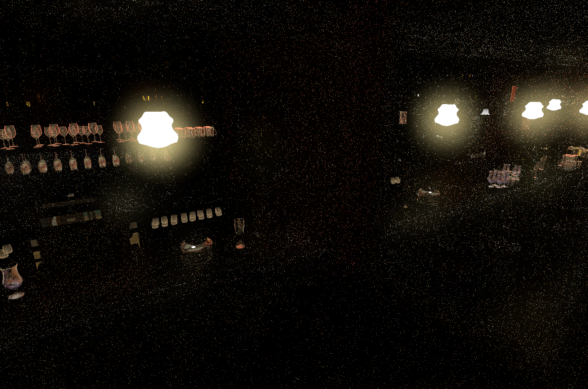

# ReSTIR PT

## Introduction

Reservoir SpatioTemporal Importance Resampling for Path Tracing (ReSTIR PT) is a resampling algorithm for path tracers that dramatically increases the effective sample count per pixel. ReSTIR PT allows paths sampled from one pixel to reconnect to paths from other pixels, allowing high quality light paths to quickly propagate across the screen and accumulate over time.

ReSTIR PT is an embodiment of [Generalized Resampled Importance Sampling by Lin et al.](https://d1qx31qr3h6wln.cloudfront.net/publications/sig22_GRIS.pdf)

 | 
:-----------------------------------------|-----------------------------------------------------:
Indirect path tracer output with no reuse | Indirect path tracer output with ReSTIR PT

## Algorithm Integration Overview

ReSTIR PT starts by acquiring initial samples from a path tracer. The RTXDI runtime requires that an `RAB_PathTrace` function be implemented accordingly. The implementation of the path tracer is up to the developer, but it must call all of the required functions of the `RTXDI_PathTracerContext` at the proper times. These functions primarily relate to recording the surface of each bounce, as well as whether light is being sampled for the path via emission from the hit surface, next event estimation (NEE), or the environment map on miss. At the end of the path tracing loop, the `RTXDI_PathTracerContext` has the information needed to create an `RTXDI_PTReservoir` data structure, which stores the information required for resampling paths between pixels. Note that the reservoir does **not** store the accumulated radiance from all light sources along the path, but instead selects a single path from all of the potential ones it receives.

The temporal resampling pass uses motion vector data to reproject a pixel's surface back into the previous frame. If the previous frame's surface is sufficiently similar to the current frame's surface, ReSTIR PT tries to use the previous frame's reservoir to generate a path in the present frame that is similar to the one used to generate the previous frame's reservoir. This process of transforming a path taken from one domain into a similar path taken from a similar domain is a process known as shift mapping. (There are several methods of shift mapping, and RTXDI uses its own hybrid shift map, more details of which are explained in a dedicated section below.) If the shift mapping is successful, then the current pixel's reservoir is updated to use the shifted path with probability proportional to its quality. 

The spatial resampling pass is similar to the temporal resampling pass, but it resamples nearby pixels within the same frame, rather than a single reprojected pixel in the previous frame.

Nearly all of the integration work required for ReSTIR PT resides in implementing `RAB_PathTrace` and calling the `RTXDI_PathTracerContext` properly - **developers are strongly encouraged to use the Full Sample's implementation of `RAB_PathTrace` as a reference for doing so**. The `RTXDI_CompyteHybridShift` function employed by temporal and spatial resampling passes reuses `RAB_PathTrace` for generating most of the new path. The shift mapping logic inherently requires that some of the path tracing functionality be handled by `RTXDI_ComputeHybridShift` after `RAB_PathTrace` has finished. As a result, developers must implement several additional `RAB_*` functions to bridge this gap. The good news is that because these functions need to replicate logic that is already implemented by the path tracer, there is little additional work that needs to be done. In fact, it is recommended developers use these callbacks inside the path tracer to ensure consistency between initial sampling and hybrid shift.

The reservoir contains all the information required to shade the pixel's indirect lighting contribution. The product of the `WeightSum` and `TargetFunction` fields produces the final radiance value, which can then be apportioned to the diffuse and specular components by the application's shading code as needed. If the reservoir's `RcVertexLength` field is greater than 2, the incoming light direction needs to be regenerated to match the one used in `RAB_PathTrace`. See the FinalShading.hlsl shader for an example implementation.

## Hybrid Shift

A path from one pixel cannot simply be donated to another pixel. The neighboring pixel's path must be sufficiently similar to one taken from the target reservoir, and even then the exact path isn't shared, but is instead recreated as though it had come from the target pixel. This process of intelligently translating path information between pixels is called shift mapping, and ReSTIR PT makes use of a particular method of shift mapping called hybrid shift.

### Recording Hybrid Shift Data During Initial Sampling

They hybrid shift process starts during initial sampling. At each bounce in the path, the `RTXDI_PathTracerContext` analyzes whether the surface 1) satisfies certain roughness criteria and 2) is sufficiently far from the previous surface. When a sequential pair of surfaces along the path are both sufficiently rough enough and far enough apart, the context records the second vertex as the reconnection vertex, or `RcVertex`. The utility of this reconnection vertex becomes clear in the discussion of random replay, discussed below.

Independently of this process for determining the reconnection vertex, the `RTXDI_PathTracerContext` also analyzes each potential path to the light as it is sampled via emissive hit surface evaluation, NEE, or the environment map when the ray misses. The context determines stochastically  chooses the light path in proportion to its contribution, such that the brightest paths have the highest chances of being selected.

At the end of the initial path tracing loop, the context is left with the following key pieces of information:

- A final bounce depth from the primary surface to the winning light source
- A reconnection vertex depth, if one was found
- The random number state used to generate the path via BRDF sampling
- Additional information related to reconnection (explained below) and key probability values.

### Shifting From One Path To Another

The `ComputeHybridShift` function, whether called from the temporal resampling pass or the spatial resampling pass, uses this reservoir information to shift a target reservoir's path to a temporal or spatial neighbor reservoir's path. 

- First, the two neighboring surfaces are compared for material and geometric similarity. If they are too dissimilar, the hybrid shift fails immediately. For example, the best light path for a pixel on a glossy fork is unlikely to be a good path for a pixel on the diffuse napkin beneath it.
- If the neighboring surfaces are similar, the `RAB_PathTrace` function is invoked in a process called **random replay**. Random replay regenerates a path starting from the target surface using the neighbor reservoir's cached random number state that was used to generate its own path. The spatial and temporal coherence of the scene generally means that this replayed path, though offset in time and space, is highly likely to produce a path from the target surface that provides a very similar amount of light to the one generated for the neighbor surface.
- However, the path is not always replayed in its entirety. If the neighbor path has a reconnection vertex along it at bounce N, then the random replay path can divert to it from bounce N-1 and avoid tracing the rest of the path. The reason the reconnection vertex and the one before it must be sufficiently rough is to ensure minimal loss in throughput as a result of diverting the path. If one surface were instead glossy, for example, then the likelihood that it would reflect the same light towards the shifted N-1 vertex is much lower.
- When the path reconnects to an NEE-sampled light, the last bounce of the path tracer is handled by `ComputeHybridShift` itself, rather than inside `RAB_PathTrace`. The `RAB_*` interface functions for sampling this light are the same as the ones used by ReSTIR DI, with the additional requirement of three `RAB_GetMISWeightForNEE`, `RAB_GetMISWeightForEmissiveSurface`, and `RAB_GetMISWeightForEnvironmentMap`.
- If all goes well, the target surface will have generated a new path via random replay to the same light source that its neighbor traced.

### `RTXDI_PathTracingContext`  During Random Replay

During the random replay process, the `RTXDI_PathTracingContext` no longer considers alternate light paths through the scene. In fact, it signals to `RAB_PathTrace` that it should not sample any light sources but potentially the ultimately one chosen in the original path. Instead, it analyzes whether the replayed path meets the various algorithmic requirements of ReSTIR PT. One such requirement is that the reconnection vertex must arise at the same point in the path as in the neighbor's path, or not at all if the neighbor's path does not have one. Thus, if bounces 3 and 4 in the neighbor's path are rough and distant, but the path replayed from the target surface encounters a glossy surface at bounce 3, then the shift is invalid and resampling halts.

## `RAB_PathTracerUserData`

The `RAB_PathTracerUserData` struct provides a way for the application-defined `RAB_PathTrace` function to send information back out from the RTXDI runtime functions to their callers. This struct is used in the sample to collect PSR information for the denoiser (explained below). The struct also must implement the trivial `RAB_PathTracerUserDataSetPathType` function, which the runtime functions use to tell the path tracer which part of the resampling algorithm it's being called from. The sample's PSR implementation uses this field to disable PSR updates during inverse shift mappings, which are only done to check for correctness.

## Denoiser Integration

Path tracers are stochastic algorithms that produce noisy outputs. One approach to removing noise is to accumulate many samples until the final image converges. However, even with ReSTIR PT, this process is too slow for real time applications. Instead, path tracing output is sent to a dedicated denoiser algorithm, which, as its name suggests, smooths out the signal. Denoisers require many pieces of information per pixel, such as the surface's location, normal, and material properties. This information is fed to denoisers on a per-pixel basis via textures called "guide buffers."

For non-mirror primary surfaces, the GBuffer fill pass generates most of the denoiser guide buffers anyway, and lighting passes generate diffuse and specular `hitT` values.

However, denoising of mirror surfaces can be optimized by Primary Surface Replacement (PSR) in denoisers like NRD. The interaction between PSR and ReSTIR PT's resampling logic is fairly complicated, since resampling changes the correct values for the guide buffers. Likewise, features like Russian roulette that stochastically terminate paths early need to be disabled during mirror bounces to avoid generating improperly noisy guide buffers.
